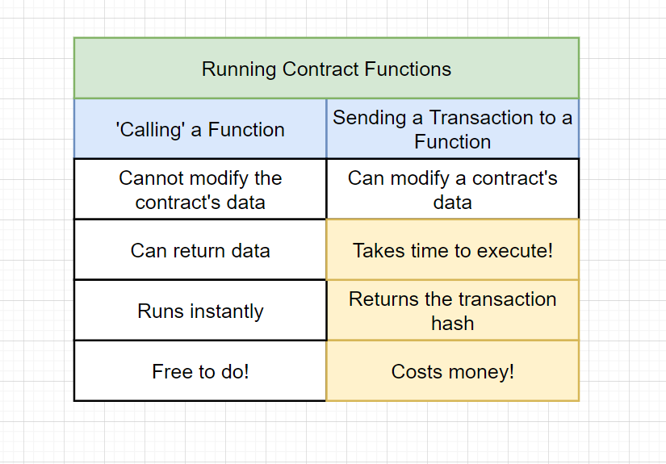

## Create a simple smart contract

```
pragma solidity ^0.8.9;

contract Inbox {
    string public message;

    constructor(string memory initialMessage) {
        message = initialMessage;
    }

    // in Java the setMessage looks like this:
    /*
        public void setMessage(String newMessage) {}
    */

    function setMessage(string memory newMessage) public {
        message = newMessage;
    }
}
```




## Solidity Compiler


```
const path = require('path')
const fs = require('fs')
const solc = require('solc')

const inboxPath = path.resolve(__dirname, 'contracts', 'Inbox.sol')
const source = fs.readFileSync(inboxPath, 'utf-8')

const input = {
  language: 'Solidity',
  sources: {
    'Inbox.sol': {
      content: source,
    },
  },
  settings: {
    outputSelection: {
      '*': {
        '*': ['*'],
      },
    },
  },
};


module.exports = JSON.parse(solc.compile(JSON.stringify(input))).contracts[
  'Inbox.sol'
].Inbox;

```

## Using Web3 and Ganache to get accounts and deploy to Ganache local network


```
const ganache = require('ganache-cli')
const Web3 = require('web3')
const {abi, evm} = require('../compile')

const web3 = new Web3(ganache.provider())


let inbox

let accounts

const deploy = async () => {
    //get a list of all accounts from ganache
    accounts = await web3.eth.getAccounts()

    //use the first account to deploy the contract
    inbox = await new web3.eth.Contract(abi)
        .deploy({data: evm.bytecode.object, arguments: ['Hi there!']})
        .send({from: accounts[0], gas: '1000000'})

})

```

## Using Truffle and Infura Endpoint to deploy to Rinkeby network


### infura.io
https://infura.io

```
const HDWalletProvider = require('@truffle/hdwallet-provider')
const Web3 = require('web3')
const { abi, evm } = require('./compile')

const provider = new HDWalletProvider(
    process.env.mnemonic,
    process.env.rinkebyEndpoint
)

const web3 = new Web3(provider)

const deploy = async() => {
    const accounts = await web3.eth.getAccounts()
    console.log('account available: ',accounts)

    const result = await new web3.eth.Contract(abi)
        .deploy({data: evm.bytecode.object, arguments: ['Hi there!']})
        .send({from: accounts[0], gas: '1000000'})

    console.log('deploy result: ',result)
    console.log('deployed contract address: ',result.options.address) // 0xA022F5865F75B41AB13e7ec6D10737918e584135  //0x8C4eb414c6276a1518c36B70E65C73d73c5CCafD
    provider.engine.stop()
}
```

## Check the contract on Etherscan
https://rinkeby.etherscan.io/address/0x8C4eb414c6276a1518c36B70E65C73d73c5CCafD


#### Some other contract examples

```
  pragma solidity ^0.4.17;


contract Campaign {
    struct Request {
        string description;
        uint value;
        address recipient;
        bool complete;
        uint approvalCount;
        mapping(address => bool) approvals;
    }

    Request[] public requests;
    address public manager;
    uint public minimumContribution;
    mapping(address => bool) public approvers;
    uint public approversCount;

    modifier restricted() {
        require(msg.sender == manager);
        _;
    }

    constructor(uint minimum) public {
        manager = msg.sender;
        minimumContribution = minimum;
    }

    function contribute() public payable {
        require(msg.value > minimumContribution);

        approvers[msg.sender] = true;
        approversCount++;
    }

    function createRequest(string description, uint value, address recipient) public restricted {
        Request memory newRequest = Request({
           description: description,
           value: value,
           recipient: recipient,
           complete: false,
           approvalCount: 0
        });

        requests.push(newRequest);
    }

    function approveRequest(uint index) public {
        Request storage request = requests[index];

        require(approvers[msg.sender]);
        require(!request.approvals[msg.sender]);

        request.approvals[msg.sender] = true;
        request.approvalCount++;
    }

    function finalizeRequest(uint index) public restricted {
        Request storage request = requests[index];

        require(request.approvalCount > (approversCount / 2));
        require(!request.complete);

        request.recipient.transfer(request.value);
        request.complete = true;
    }
}

```


```
pragma solidity ^0.4.17;

contract CampaignFactory {
    address[] public deployedCampaigns;

    function createCampaign(uint minimum) public {
        address newCampaign = new Campaign(minimum, msg.sender);
        deployedCampaigns.push(newCampaign);
    }

    function getDeployedCampaigns() public view returns (address[]) {
        return deployedCampaigns;
    }
}

contract Campaign {
    struct Request {
        string description;
        uint value;
        address recipient;
        bool complete;
        uint approvalCount;
        mapping(address => bool) approvals;
    }

    Request[] public requests;
    address public manager;
    uint public minimumContribution;
    mapping(address => bool) public approvers;
    uint public approversCount;

    modifier restricted() {
        require(msg.sender == manager);
        _;
    }

    constructor(uint minimum, address creator) public {
        manager = creator;
        minimumContribution = minimum;
    }

    function contribute() public payable {
        require(msg.value > minimumContribution);

        approvers[msg.sender] = true;
        approversCount++;
    }

    function createRequest(string description, uint value, address recipient) public restricted {
        Request memory newRequest = Request({
           description: description,
           value: value,
           recipient: recipient,
           complete: false,
           approvalCount: 0
        });

        requests.push(newRequest);
    }

    function approveRequest(uint index) public {
        Request storage request = requests[index];

        require(approvers[msg.sender]);
        require(!request.approvals[msg.sender]);

        request.approvals[msg.sender] = true;
        request.approvalCount++;
    }

    function finalizeRequest(uint index) public restricted {
        Request storage request = requests[index];

        require(request.approvalCount > (approversCount / 2));
        require(!request.complete);

        request.recipient.transfer(request.value);
        request.complete = true;
    }
    
    function getSummary() public view returns (
      uint, uint, uint, uint, address
      ) {
        return (
          minimumContribution,
          this.balance,
          requests.length,
          approversCount,
          manager
        );
    }
    
    function getRequestsCount() public view returns (uint) {
        return requests.length;
    }
}

```